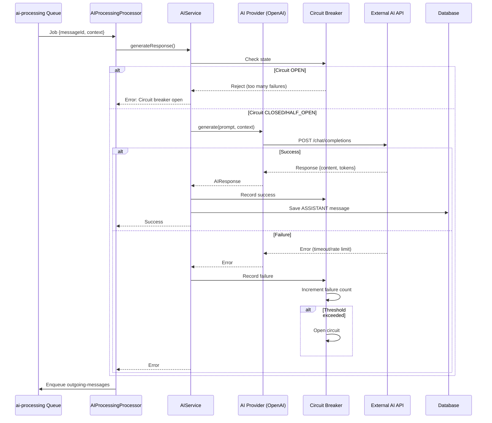

# Procesamiento de IA

Este documento describe cómo el sistema genera respuestas usando proveedores de Inteligencia Artificial, incluyendo la configuración, el flujo de procesamiento y el manejo de errores con circuit breaker.

## Arquitectura de IA

```
┌─────────────────────────────────────────────────────────┐
│                  AI Processing Layer                     │
│                                                          │
│  ┌──────────────┐    ┌──────────────┐    ┌──────────┐ │
│  │      AI      │───▶│   Provider   │───▶│ Circuit  │ │
│  │  Processing  │    │   Registry   │    │ Breaker  │ │
│  │  Processor   │    │              │    │          │ │
│  └──────────────┘    └──────────────┘    └──────────┘ │
│         │                    │                  │       │
│         │                    │                  │       │
│         ▼                    ▼                  ▼       │
│  ┌──────────────┐    ┌──────────────┐    ┌──────────┐ │
│  │      AI      │    │    OpenAI    │    │  Anthropic│ │
│  │   Service    │    │   Provider   │    │  Provider │ │
│  └──────────────┘    └──────────────┘    └──────────┘ │
└─────────────────────────────────────────────────────────┘
                               │
                               ▼
                        ┌──────────────┐
                        │  External    │
                        │  AI APIs     │
                        └──────────────┘
```

## Flujo de Procesamiento

### Diagrama de Secuencia



## Componentes

### 1. AI Processing Processor

**Archivo:** `backend/src/modules/queues/processors/ai-processing.processor.ts`

Procesador de cola que coordina la generación de respuestas.

**Responsabilidades:**
- Consumir trabajos de la cola `ai-processing`
- Obtener contexto de conversación
- Llamar al AIService para generar respuesta
- Guardar mensaje ASSISTANT
- Encolar mensaje para envío

**Código:**
```typescript
@Processor('ai-processing')
export class AIProcessingProcessor {
  @Process('process-ai')
  async handleAIProcessing(job: Job) {
    const { messageId, conversationId, chatbotId, context } = job.data;
    
    this.logger.log(`Processing AI for message ${messageId}`);
    
    try {
      // 1. Obtener mensaje del usuario
      const userMessage = await this.messagesService.findOne(messageId);
      
      // 2. Generar respuesta con IA
      const aiResponse = await this.aiService.generateResponse({
        chatbotId,
        messages: context,
        userMessage: userMessage.content
      });
      
      // 3. Guardar mensaje ASSISTANT
      const assistantMessage = await this.messagesService.create({
        conversationId,
        content: aiResponse.content,
        role: 'ASSISTANT',
        channel: userMessage.channel,
        metadata: {
          provider: aiResponse.provider,
          model: aiResponse.model,
          tokensUsed: aiResponse.tokensUsed,
          responseTime: aiResponse.responseTime
        }
      });
      
      // 4. Encolar para envío
      await this.queueService.enqueueOutgoingMessage({
        messageId: assistantMessage.id,
        conversationId,
        channel: userMessage.channel
      });
      
      this.logger.log(`AI processing completed for message ${messageId}`);
      
    } catch (error) {
      this.logger.error(`AI processing failed: ${error.message}`, error.stack);
      throw error; // BullMQ will retry
    }
  }
}
```

---

### 2. AI Service

**Archivo:** `backend/src/modules/ai/ai.service.ts`

Servicio principal que coordina los proveedores de IA.

**Responsabilidades:**
- Seleccionar proveedor según configuración del chatbot
- Construir prompt con contexto
- Manejar circuit breaker
- Registrar métricas de uso

**Código:**
```typescript
@Injectable()
export class AIService {
  async generateResponse(params: GenerateResponseParams): Promise<AIResponse> {
    const { chatbotId, messages, userMessage } = params;
    
    // 1. Obtener configuración del chatbot
    const chatbot = await this.chatbotsService.findOne(chatbotId);
    
    if (!chatbot.aiProvider || !chatbot.aiModel) {
      throw new Error('Chatbot AI configuration missing');
    }
    
    // 2. Obtener proveedor
    const provider = this.getProvider(chatbot.aiProvider);
    
    // 3. Verificar circuit breaker
    const circuitBreaker = this.circuitBreakers.get(chatbot.aiProvider);
    if (circuitBreaker.isOpen()) {
      throw new Error(`Circuit breaker open for ${chatbot.aiProvider}`);
    }
    
    // 4. Construir prompt
    const prompt = this.buildPrompt(chatbot, messages, userMessage);
    
    try {
      // 5. Generar respuesta
      const startTime = Date.now();
      const response = await provider.generate({
        model: chatbot.aiModel,
        messages: prompt,
        temperature: chatbot.temperature || 0.7,
        maxTokens: chatbot.maxTokens || 500
      });
      const responseTime = Date.now() - startTime;
      
      // 6. Registrar éxito
      circuitBreaker.recordSuccess();
      
      // 7. Registrar uso
      await this.usageService.logUsage({
        chatbotId,
        provider: chatbot.aiProvider,
        model: chatbot.aiModel,
        tokensUsed: response.tokensUsed,
        cost: this.calculateCost(chatbot.aiProvider, chatbot.aiModel, response.tokensUsed)
      });
      
      return {
        content: response.content,
        provider: chatbot.aiProvider,
        model: chatbot.aiModel,
        tokensUsed: response.tokensUsed,
        responseTime
      };
      
    } catch (error) {
      // 8. Registrar fallo
      circuitBreaker.recordFailure();
      
      this.logger.error(`AI generation failed: ${error.message}`, {
        provider: chatbot.aiProvider,
        model: chatbot.aiModel,
        error: error.message
      });
      
      throw error;
    }
  }
  
  private buildPrompt(
    chatbot: Chatbot,
    context: Message[],
    userMessage: string
  ): ChatMessage[] {
    const messages: ChatMessage[] = [];
    
    // System prompt
    if (chatbot.systemPrompt) {
      messages.push({
        role: 'system',
        content: chatbot.systemPrompt
      });
    }
    
    // Contexto de conversación (últimos N mensajes)
    const contextLimit = 10;
    const recentMessages = context.slice(-contextLimit);
    
    for (const msg of recentMessages) {
      messages.push({
        role: msg.role.toLowerCase() as 'user' | 'assistant',
        content: msg.content
      });
    }
    
    // Mensaje actual del usuario
    messages.push({
      role: 'user',
      content: userMessage
    });
    
    return messages;
  }
}
```

---

### 3. AI Providers

Los proveedores implementan la interfaz común para diferentes APIs de IA.

#### Interfaz Base

```typescript
export interface AIProvider {
  name: string;
  
  generate(params: GenerateParams): Promise<GenerateResponse>;
  
  validateConfig(): boolean;
}

export interface GenerateParams {
  model: string;
  messages: ChatMessage[];
  temperature?: number;
  maxTokens?: number;
}

export interface GenerateResponse {
  content: string;
  tokensUsed: number;
  finishReason: string;
}

export interface ChatMessage {
  role: 'system' | 'user' | 'assistant';
  content: string;
}
```

#### OpenAI Provider

**Archivo:** `backend/src/modules/ai/providers/openai.provider.ts`

```typescript
@Injectable()
export class OpenAIProvider implements AIProvider {
  name = 'openai';
  private client: OpenAI;
  
  constructor(private configService: ConfigService) {
    const apiKey = this.configService.get('OPENAI_API_KEY');
    
    if (!apiKey) {
      throw new Error('OPENAI_API_KEY not configured');
    }
    
    this.client = new OpenAI({ apiKey });
  }
  
  async generate(params: GenerateParams): Promise<GenerateResponse> {
    const { model, messages, temperature = 0.7, maxTokens = 500 } = params;
    
    try {
      const completion = await this.client.chat.completions.create({
        model,
        messages,
        temperature,
        max_tokens: maxTokens
      });
      
      return {
        content: completion.choices[0].message.content,
        tokensUsed: completion.usage.total_tokens,
        finishReason: completion.choices[0].finish_reason
      };
      
    } catch (error) {
      if (error.status === 429) {
        throw new Error('OpenAI rate limit exceeded');
      }
      if (error.status === 401) {
        throw new Error('OpenAI API key invalid');
      }
      throw error;
    }
  }
  
  validateConfig(): boolean {
    return !!this.configService.get('OPENAI_API_KEY');
  }
}
```

#### Anthropic Provider

**Archivo:** `backend/src/modules/ai/providers/anthropic.provider.ts`

```typescript
@Injectable()
export class AnthropicProvider implements AIProvider {
  name = 'anthropic';
  private client: Anthropic;
  
  constructor(private configService: ConfigService) {
    const apiKey = this.configService.get('ANTHROPIC_API_KEY');
    
    if (!apiKey) {
      throw new Error('ANTHROPIC_API_KEY not configured');
    }
    
    this.client = new Anthropic({ apiKey });
  }
  
  async generate(params: GenerateParams): Promise<GenerateResponse> {
    const { model, messages, temperature = 0.7, maxTokens = 500 } = params;
    
    // Anthropic requiere separar system prompt
    const systemPrompt = messages.find(m => m.role === 'system')?.content;
    const chatMessages = messages.filter(m => m.role !== 'system');
    
    try {
      const message = await this.client.messages.create({
        model,
        max_tokens: maxTokens,
        temperature,
        system: systemPrompt,
        messages: chatMessages
      });
      
      return {
        content: message.content[0].text,
        tokensUsed: message.usage.input_tokens + message.usage.output_tokens,
        finishReason: message.stop_reason
      };
      
    } catch (error) {
      if (error.status === 429) {
        throw new Error('Anthropic rate limit exceeded');
      }
      if (error.status === 401) {
        throw new Error('Anthropic API key invalid');
      }
      throw error;
    }
  }
  
  validateConfig(): boolean {
    return !!this.configService.get('ANTHROPIC_API_KEY');
  }
}
```

---

### 4. Circuit Breaker

**Archivo:** `backend/src/modules/ai/circuit-breaker.ts`

Implementación del patrón Circuit Breaker para proteger contra fallos en cascada.

**Estados:**
- **CLOSED**: Funcionamiento normal, todas las peticiones pasan
- **OPEN**: Demasiados fallos, todas las peticiones son rechazadas
- **HALF_OPEN**: Período de prueba, algunas peticiones pasan

```typescript
export enum CircuitState {
  CLOSED = 'CLOSED',
  OPEN = 'OPEN',
  HALF_OPEN = 'HALF_OPEN'
}

export class CircuitBreaker {
  private state: CircuitState = CircuitState.CLOSED;
  private failureCount = 0;
  private successCount = 0;
  private lastFailureTime?: Date;
  
  constructor(
    private readonly failureThreshold: number = 5,
    private readonly resetTimeout: number = 60000, // 1 minute
    private readonly halfOpenRequests: number = 3
  ) {}
  
  isOpen(): boolean {
    if (this.state === CircuitState.OPEN) {
      // Check if reset timeout has passed
      const now = Date.now();
      const timeSinceLastFailure = now - this.lastFailureTime.getTime();
      
      if (timeSinceLastFailure >= this.resetTimeout) {
        this.state = CircuitState.HALF_OPEN;
        this.successCount = 0;
        return false;
      }
      
      return true;
    }
    
    return false;
  }
  
  recordSuccess(): void {
    this.failureCount = 0;
    
    if (this.state === CircuitState.HALF_OPEN) {
      this.successCount++;
      
      if (this.successCount >= this.halfOpenRequests) {
        this.state = CircuitState.CLOSED;
        this.successCount = 0;
      }
    }
  }
  
  recordFailure(): void {
    this.failureCount++;
    this.lastFailureTime = new Date();
    
    if (this.failureCount >= this.failureThreshold) {
      this.state = CircuitState.OPEN;
    }
  }
  
  getState(): CircuitState {
    return this.state;
  }
  
  getStats() {
    return {
      state: this.state,
      failureCount: this.failureCount,
      successCount: this.successCount,
      lastFailureTime: this.lastFailureTime
    };
  }
  
  reset(): void {
    this.state = CircuitState.CLOSED;
    this.failureCount = 0;
    this.successCount = 0;
    this.lastFailureTime = undefined;
  }
}
```

**Uso:**
```typescript
// En AIService
private circuitBreakers = new Map<string, CircuitBreaker>();

constructor() {
  // Crear circuit breaker para cada proveedor
  this.circuitBreakers.set('openai', new CircuitBreaker(5, 60000, 3));
  this.circuitBreakers.set('anthropic', new CircuitBreaker(5, 60000, 3));
}
```

---

## Configuración de Chatbot

### Modelo de Datos

```prisma
model Chatbot {
  id            String   @id @default(uuid())
  name          String
  
  // AI Configuration
  aiProvider    String?  // 'openai', 'anthropic', etc.
  aiModel       String?  // 'gpt-4', 'claude-3-opus', etc.
  systemPrompt  String?  @db.Text
  temperature   Float?   @default(0.7)
  maxTokens     Int?     @default(500)
  
  // Other fields...
  createdAt     DateTime @default(now())
  updatedAt     DateTime @updatedAt
}
```

### Ejemplo de Configuración

```typescript
// Crear chatbot con configuración de IA
const chatbot = await prisma.chatbot.create({
  data: {
    name: 'Customer Support Bot',
    aiProvider: 'openai',
    aiModel: 'gpt-4',
    systemPrompt: `You are a helpful customer support assistant.
      Be polite, professional, and concise in your responses.
      If you don't know the answer, say so honestly.`,
    temperature: 0.7,
    maxTokens: 500
  }
});
```

### Modelos Disponibles

#### OpenAI
- `gpt-4` - Más capaz, más caro
- `gpt-4-turbo` - Más rápido, más barato
- `gpt-3.5-turbo` - Rápido y económico

#### Anthropic
- `claude-3-opus-20240229` - Más capaz
- `claude-3-sonnet-20240229` - Balanceado
- `claude-3-haiku-20240307` - Más rápido

---

## Variables de Entorno

```bash
# OpenAI
OPENAI_API_KEY=sk-...

# Anthropic
ANTHROPIC_API_KEY=sk-ant-...

# Circuit Breaker Configuration
AI_CIRCUIT_BREAKER_THRESHOLD=5
AI_CIRCUIT_BREAKER_TIMEOUT=60000
AI_CIRCUIT_BREAKER_HALF_OPEN_REQUESTS=3
```

---

## Logs Esperados

### Procesamiento Exitoso

```json
{
  "timestamp": "2025-11-21T10:30:00.500Z",
  "level": "info",
  "message": "Starting AI processing",
  "context": "AIProcessingProcessor",
  "data": {
    "jobId": "job-123",
    "messageId": "msg-uuid",
    "chatbotId": "chatbot-uuid"
  }
}

{
  "timestamp": "2025-11-21T10:30:00.600Z",
  "level": "info",
  "message": "Generating AI response",
  "context": "AIService",
  "data": {
    "provider": "openai",
    "model": "gpt-4",
    "contextMessages": 5
  }
}

{
  "timestamp": "2025-11-21T10:30:01.800Z",
  "level": "info",
  "message": "AI response generated",
  "context": "AIService",
  "data": {
    "provider": "openai",
    "model": "gpt-4",
    "tokensUsed": 150,
    "responseTime": 1200,
    "contentLength": 85
  }
}

{
  "timestamp": "2025-11-21T10:30:01.900Z",
  "level": "info",
  "message": "ASSISTANT message saved",
  "context": "AIProcessingProcessor",
  "data": {
    "messageId": "msg-assistant-uuid",
    "conversationId": "conv-uuid"
  }
}
```

### Circuit Breaker Activado

```json
{
  "timestamp": "2025-11-21T10:30:00.500Z",
  "level": "error",
  "message": "AI generation failed",
  "context": "AIService",
  "data": {
    "provider": "openai",
    "model": "gpt-4",
    "error": "OpenAI rate limit exceeded"
  }
}

{
  "timestamp": "2025-11-21T10:30:00.501Z",
  "level": "warn",
  "message": "Circuit breaker failure recorded",
  "context": "CircuitBreaker",
  "data": {
    "provider": "openai",
    "failureCount": 5,
    "threshold": 5,
    "state": "OPEN"
  }
}

{
  "timestamp": "2025-11-21T10:30:00.502Z",
  "level": "error",
  "message": "Circuit breaker open",
  "context": "AIService",
  "data": {
    "provider": "openai",
    "state": "OPEN",
    "lastFailure": "2025-11-21T10:30:00.500Z"
  }
}
```

---

## Manejo de Errores

### Tipos de Errores

#### 1. Configuration Errors
```typescript
// API key no configurada
throw new Error('OPENAI_API_KEY not configured');

// Chatbot sin configuración de IA
throw new Error('Chatbot AI configuration missing');
```

#### 2. API Errors
```typescript
// Rate limit
if (error.status === 429) {
  throw new Error('OpenAI rate limit exceeded');
}

// Authentication
if (error.status === 401) {
  throw new Error('OpenAI API key invalid');
}

// Timeout
if (error.code === 'ETIMEDOUT') {
  throw new Error('OpenAI request timeout');
}
```

#### 3. Circuit Breaker Errors
```typescript
if (circuitBreaker.isOpen()) {
  throw new Error(`Circuit breaker open for ${provider}`);
}
```

### Estrategia de Retry

```typescript
// En queue configuration
{
  attempts: 3,
  backoff: {
    type: 'exponential',
    delay: 2000 // 2s, 4s, 8s
  }
}
```

**Cuándo hacer retry:**
- ✅ Timeout de red
- ✅ Rate limit (429)
- ✅ Error temporal del servidor (503)
- ❌ API key inválida (401)
- ❌ Modelo no existe (404)
- ❌ Circuit breaker abierto

---

## Monitoreo y Métricas

### Health Check Endpoint

```bash
GET /health/ai-providers
```

**Respuesta:**
```json
{
  "providers": [
    {
      "name": "openai",
      "configured": true,
      "circuitBreaker": {
        "state": "CLOSED",
        "failureCount": 0,
        "lastFailure": null
      }
    },
    {
      "name": "anthropic",
      "configured": false,
      "circuitBreaker": {
        "state": "CLOSED",
        "failureCount": 0,
        "lastFailure": null
      }
    }
  ]
}
```

### Métricas a Monitorear

1. **Tasa de Éxito**
   - Porcentaje de respuestas generadas exitosamente
   - Meta: > 99%

2. **Tiempo de Respuesta**
   - Tiempo promedio de generación
   - Meta: < 2 segundos

3. **Tokens Utilizados**
   - Total de tokens por día/mes
   - Costo asociado

4. **Estado de Circuit Breaker**
   - Frecuencia de activación
   - Tiempo en estado OPEN

5. **Errores por Tipo**
   - Rate limits
   - Timeouts
   - Authentication errors

---

## Optimizaciones

### 1. Caché de Respuestas

Para preguntas frecuentes, cachear respuestas:

```typescript
private cache = new Map<string, CachedResponse>();

async generateResponse(params: GenerateResponseParams) {
  const cacheKey = this.getCacheKey(params);
  
  if (this.cache.has(cacheKey)) {
    return this.cache.get(cacheKey);
  }
  
  const response = await this.provider.generate(params);
  this.cache.set(cacheKey, response);
  
  return response;
}
```

### 2. Streaming de Respuestas

Para respuestas largas, usar streaming:

```typescript
async *generateStream(params: GenerateParams) {
  const stream = await this.client.chat.completions.create({
    ...params,
    stream: true
  });
  
  for await (const chunk of stream) {
    yield chunk.choices[0]?.delta?.content || '';
  }
}
```

### 3. Fallback Provider

Si un proveedor falla, usar otro:

```typescript
async generateResponse(params: GenerateResponseParams) {
  try {
    return await this.primaryProvider.generate(params);
  } catch (error) {
    this.logger.warn('Primary provider failed, using fallback');
    return await this.fallbackProvider.generate(params);
  }
}
```

---

## Testing

### Unit Tests

```typescript
describe('AIService', () => {
  it('should generate response with OpenAI', async () => {
    const response = await aiService.generateResponse({
      chatbotId: 'test-bot',
      messages: [],
      userMessage: 'Hello'
    });
    
    expect(response.content).toBeDefined();
    expect(response.provider).toBe('openai');
  });
  
  it('should activate circuit breaker after failures', async () => {
    // Simulate 5 failures
    for (let i = 0; i < 5; i++) {
      try {
        await aiService.generateResponse(params);
      } catch (error) {
        // Expected
      }
    }
    
    const breaker = aiService.getCircuitBreaker('openai');
    expect(breaker.getState()).toBe(CircuitState.OPEN);
  });
});
```

### Integration Tests

```typescript
describe('AI Processing E2E', () => {
  it('should process message and generate response', async () => {
    // Enqueue message
    await queueService.enqueueAIProcessing({
      messageId: 'test-msg',
      conversationId: 'test-conv',
      chatbotId: 'test-bot'
    });
    
    // Wait for processing
    await waitForJobCompletion('ai-processing');
    
    // Verify ASSISTANT message created
    const messages = await messagesService.findByConversation('test-conv');
    const assistant = messages.find(m => m.role === 'ASSISTANT');
    
    expect(assistant).toBeDefined();
    expect(assistant.content).toBeTruthy();
  });
});
```

---

## Referencias

- [OpenAI API Documentation](https://platform.openai.com/docs/api-reference)
- [Anthropic API Documentation](https://docs.anthropic.com/claude/reference)
- [Circuit Breaker Pattern](https://martinfowler.com/bliki/CircuitBreaker.html)
- [BullMQ Documentation](https://docs.bullmq.io/)
