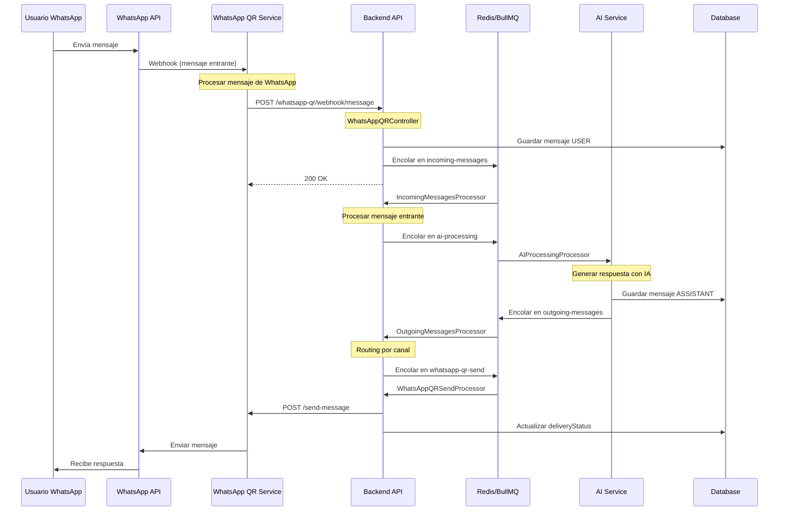

# Flujo de Mensajes - WhatsApp QR

Este documento describe el flujo completo de mensajes desde que un usuario envía un mensaje a través de WhatsApp hasta que recibe la respuesta del chatbot.

## Diagrama de Secuencia



## Pasos Detallados del Flujo

### 1. Usuario Envía Mensaje por WhatsApp

**Componente:** WhatsApp API

El usuario envía un mensaje desde su aplicación WhatsApp al número conectado.

**Acción:**
- Usuario abre chat con el número del bot
- Escribe mensaje: "Hola, necesito ayuda"
- Presiona enviar

**Datos del Mensaje:**
```json
{
  "from": "5491234567890",
  "to": "5499876543210",
  "body": "Hola, necesito ayuda",
  "timestamp": 1700567890
}
```

---

### 2. WhatsApp QR Service Recibe Mensaje

**Componente:** WhatsApp QR Service (Microservicio)

**Archivo:** `whatsapp-qr-service/src/messageHandler.ts`

El microservicio recibe el webhook de WhatsApp y procesa el mensaje.

**Código:**
```typescript
sock.ev.on('messages.upsert', async ({ messages }) => {
  for (const msg of messages) {
    if (msg.key.fromMe) continue; // Ignorar mensajes propios
    
    const from = msg.key.remoteJid;
    const body = msg.message?.conversation || 
                 msg.message?.extendedTextMessage?.text;
    
    // Enviar al backend
    await sendToBackend(sessionId, from, body);
  }
});
```

**Log Esperado:**
```json
{
  "timestamp": "2025-11-21T10:30:00.000Z",
  "level": "info",
  "message": "WhatsApp message received",
  "context": "MessageHandler",
  "data": {
    "sessionId": "session-uuid",
    "from": "5491234567890@s.whatsapp.net",
    "messageLength": 21
  }
}
```

---

### 3. Enviar Mensaje al Backend

**Componente:** WhatsApp QR Service → Backend API

El microservicio envía el mensaje al backend para procesamiento.

**Código:**
```typescript
async function sendToBackend(sessionId: string, from: string, body: string) {
  const response = await fetch(`${BACKEND_URL}/whatsapp-qr/webhook/message`, {
    method: 'POST',
    headers: { 'Content-Type': 'application/json' },
    body: JSON.stringify({
      sessionId,
      from,
      body,
      timestamp: Date.now()
    })
  });
}
```

**Log Esperado:**
```json
{
  "timestamp": "2025-11-21T10:30:00.100Z",
  "level": "info",
  "message": "Forwarding message to backend",
  "context": "MessageHandler",
  "data": {
    "sessionId": "session-uuid",
    "backendUrl": "http://backend:3000/whatsapp-qr/webhook/message"
  }
}
```

---

### 4. Backend Recibe Webhook

**Componente:** `WhatsAppQRController` → `WhatsAppQRService`

**Archivo:** `backend/src/modules/whatsapp-qr/whatsapp-qr.controller.ts`

El backend recibe el webhook y procesa el mensaje entrante.

**Código:**
```typescript
@Post('webhook/message')
async handleIncomingMessage(@Body() dto: WhatsAppQRWebhookDto) {
  return this.whatsappQRService.handleIncomingMessage(dto);
}
```

**Log Esperado:**
```json
{
  "timestamp": "2025-11-21T10:30:00.200Z",
  "level": "info",
  "message": "WhatsApp QR webhook received",
  "context": "WhatsAppQRController",
  "data": {
    "sessionId": "session-uuid",
    "from": "5491234567890@s.whatsapp.net",
    "messageLength": 21
  }
}
```

---

### 5. Buscar o Crear Conversación

**Componente:** `WhatsAppQRService`

**Archivo:** `backend/src/modules/whatsapp-qr/whatsapp-qr.service.ts`

Se busca la conversación existente o se crea una nueva.

**Código:**
```typescript
async handleIncomingMessage(dto: WhatsAppQRWebhookDto) {
  // Buscar sesión
  const session = await this.prisma.whatsAppQRSession.findUnique({
    where: { id: dto.sessionId }
  });
  
  // Buscar o crear conversación
  let conversation = await this.conversationsService.findByExternalUser(
    session.chatbotId,
    dto.from,
    'WHATSAPP_QR'
  );
  
  if (!conversation) {
    conversation = await this.conversationsService.create({
      chatbotId: session.chatbotId,
      externalUserId: dto.from,
      channel: 'WHATSAPP_QR'
    });
  }
}
```

**Log Esperado:**
```json
{
  "timestamp": "2025-11-21T10:30:00.300Z",
  "level": "info",
  "message": "Conversation found/created",
  "context": "WhatsAppQRService",
  "data": {
    "conversationId": "conv-uuid",
    "chatbotId": "chatbot-uuid",
    "externalUserId": "5491234567890@s.whatsapp.net",
    "isNew": false
  }
}
```

---

### 6. Guardar Mensaje USER

**Componente:** `MessagesService`

**Archivo:** `backend/src/modules/messages/messages.service.ts`

Se guarda el mensaje del usuario en la base de datos.

**Código:**
```typescript
const message = await this.prisma.message.create({
  data: {
    conversationId: conversation.id,
    content: dto.body,
    role: 'USER',
    channel: 'WHATSAPP_QR',
    deliveryStatus: 'RECEIVED'
  }
});
```

**Log Esperado:**
```json
{
  "timestamp": "2025-11-21T10:30:00.400Z",
  "level": "info",
  "message": "Message saved to database",
  "context": "MessagesService",
  "data": {
    "messageId": "msg-uuid",
    "conversationId": "conv-uuid",
    "role": "USER",
    "channel": "WHATSAPP_QR"
  }
}
```

---

### 7. Encolar en incoming-messages

**Componente:** `QueueService`

**Archivo:** `backend/src/modules/queues/queue.service.ts`

El mensaje se encola para procesamiento asíncrono.

**Código:**
```typescript
await this.queueService.enqueueIncomingMessage({
  messageId: message.id,
  conversationId: conversation.id,
  chatbotId: session.chatbotId
});
```

**Log Esperado:**
```json
{
  "timestamp": "2025-11-21T10:30:00.500Z",
  "level": "info",
  "message": "Message enqueued",
  "context": "QueueService",
  "data": {
    "messageId": "msg-uuid",
    "queueName": "incoming-messages",
    "jobId": "job-123"
  }
}
```

---

### 8. Procesar Mensaje Entrante

**Componente:** `IncomingMessagesProcessor`

**Archivo:** `backend/src/modules/queues/processors/incoming-messages.processor.ts`

El procesador consume el trabajo y prepara para IA.

**Código:**
```typescript
@Process('process-incoming')
async handleIncomingMessage(job: Job) {
  const { messageId, conversationId, chatbotId } = job.data;
  
  // Obtener contexto
  const context = await this.getConversationContext(conversationId);
  
  // Encolar para AI
  await this.queueService.enqueueAIProcessing({
    messageId,
    conversationId,
    chatbotId,
    context
  });
}
```

**Log Esperado:**
```json
{
  "timestamp": "2025-11-21T10:30:00.700Z",
  "level": "info",
  "message": "Processing incoming message",
  "context": "IncomingMessagesProcessor",
  "data": {
    "jobId": "job-123",
    "messageId": "msg-uuid",
    "conversationId": "conv-uuid"
  }
}
```

---

### 9. Generar Respuesta con IA

**Componente:** `AIProcessingProcessor` → `AIService`

**Archivo:** `backend/src/modules/queues/processors/ai-processing.processor.ts`

Se genera la respuesta usando el proveedor de IA.

**Código:**
```typescript
@Process('process-ai')
async handleAIProcessing(job: Job) {
  const { messageId, chatbotId, context } = job.data;
  
  // Generar respuesta
  const response = await this.aiService.generateResponse({
    chatbotId,
    messages: context,
    userMessage: message.content
  });
  
  // Guardar mensaje ASSISTANT
  const assistantMessage = await this.messagesService.create({
    conversationId,
    content: response.content,
    role: 'ASSISTANT',
    channel: 'WHATSAPP_QR'
  });
}
```

**Log Esperado:**
```json
{
  "timestamp": "2025-11-21T10:30:01.500Z",
  "level": "info",
  "message": "AI response generated",
  "context": "AIProcessingProcessor",
  "data": {
    "messageId": "msg-uuid",
    "assistantMessageId": "msg-assistant-uuid",
    "provider": "openai",
    "model": "gpt-4",
    "tokensUsed": 150,
    "responseTime": 1200
  }
}
```

---

### 10. Encolar Mensaje Saliente

**Componente:** `AIProcessingProcessor`

Después de generar la respuesta, se encola para envío.

**Código:**
```typescript
await this.queueService.enqueueOutgoingMessage({
  messageId: assistantMessage.id,
  conversationId,
  channel: 'WHATSAPP_QR'
});
```

**Log Esperado:**
```json
{
  "timestamp": "2025-11-21T10:30:01.600Z",
  "level": "info",
  "message": "Outgoing message enqueued",
  "context": "AIProcessingProcessor",
  "data": {
    "messageId": "msg-assistant-uuid",
    "queueName": "outgoing-messages",
    "channel": "WHATSAPP_QR"
  }
}
```

---

### 11. Procesar Mensaje Saliente (WhatsApp QR)

**Componente:** `OutgoingMessagesProcessor`

**Archivo:** `backend/src/modules/queues/processors/outgoing-messages.processor.ts`

El procesador determina que es WhatsApp QR y encola en la cola específica.

**Código:**
```typescript
@Process('send-outgoing')
async handleOutgoingMessage(job: Job) {
  const { messageId } = job.data;
  const message = await this.messagesService.findOne(messageId);
  
  if (message.channel === 'WHATSAPP_QR') {
    await this.handleWhatsAppQRMessage(message);
  }
}

private async handleWhatsAppQRMessage(message: Message) {
  // Encolar en whatsapp-qr-send
  await this.queueService.enqueueWhatsAppQRSend({
    messageId: message.id,
    conversationId: message.conversationId
  });
}
```

**Log Esperado:**
```json
{
  "timestamp": "2025-11-21T10:30:01.700Z",
  "level": "info",
  "message": "Processing outgoing message for WhatsApp QR",
  "context": "OutgoingMessagesProcessor",
  "data": {
    "messageId": "msg-assistant-uuid",
    "conversationId": "conv-uuid",
    "channel": "WHATSAPP_QR"
  }
}
```

---

### 12. Enviar Mensaje al Microservicio

**Componente:** `WhatsAppQRSendProcessor`

**Archivo:** `backend/src/modules/queues/processors/whatsapp-qr-send.processor.ts`

El procesador envía el mensaje al microservicio de WhatsApp QR.

**Código:**
```typescript
@Process('send-whatsapp-qr')
async handleWhatsAppQRSend(job: Job) {
  const { messageId, conversationId } = job.data;
  
  const message = await this.messagesService.findOne(messageId);
  const conversation = await this.conversationsService.findOne(conversationId);
  
  // Enviar al microservicio
  const result = await this.whatsappQRService.sendMessageDirect(
    conversation.chatbotId,
    conversation.externalUserId,
    message.content
  );
  
  // Actualizar estado
  await this.messagesService.updateDeliveryStatus(
    messageId,
    result.success ? 'SENT' : 'FAILED'
  );
}
```

**Log Esperado:**
```json
{
  "timestamp": "2025-11-21T10:30:01.800Z",
  "level": "info",
  "message": "Sending message to WhatsApp QR Service",
  "context": "WhatsAppQRSendProcessor",
  "data": {
    "messageId": "msg-assistant-uuid",
    "sessionId": "session-uuid",
    "to": "5491234567890@s.whatsapp.net"
  }
}
```

---

### 13. Microservicio Envía a WhatsApp

**Componente:** WhatsApp QR Service

**Archivo:** `whatsapp-qr-service/src/api.ts`

El microservicio envía el mensaje a través de la API de WhatsApp.

**Código:**
```typescript
app.post('/send-message', async (req, res) => {
  const { sessionId, to, message } = req.body;
  
  const session = sessions.get(sessionId);
  if (!session || !session.sock) {
    return res.status(400).json({ error: 'Session not connected' });
  }
  
  await session.sock.sendMessage(to, { text: message });
  
  res.json({ success: true, messageId: generateId() });
});
```

**Log Esperado:**
```json
{
  "timestamp": "2025-11-21T10:30:02.000Z",
  "level": "info",
  "message": "Message sent to WhatsApp",
  "context": "API",
  "data": {
    "sessionId": "session-uuid",
    "to": "5491234567890@s.whatsapp.net",
    "success": true
  }
}
```

---

### 14. Usuario Recibe Respuesta

**Componente:** WhatsApp API → Usuario

El usuario recibe la respuesta en su aplicación WhatsApp.

**Acción:**
- Notificación en el teléfono
- Mensaje aparece en el chat
- Usuario lee: "¡Hola! ¿En qué puedo ayudarte?"

---

## Resumen del Flujo

| Paso | Componente | Tiempo Aprox. | Estado |
|------|-----------|---------------|--------|
| 1 | WhatsApp → QR Service | 0ms | Inicio |
| 2 | QR Service (webhook) | 50ms | Recepción |
| 3 | QR Service → Backend | 100ms | Forward |
| 4 | WhatsAppQRController | 50ms | Validación |
| 5 | ConversationsService | 100ms | DB Read/Write |
| 6 | MessagesService | 100ms | DB Write |
| 7 | QueueService | 50ms | Enqueue |
| 8 | IncomingProcessor | 200ms | Procesamiento |
| 9 | AIProcessor | 1000ms | IA |
| 10 | QueueService | 50ms | Enqueue |
| 11 | OutgoingProcessor | 100ms | Routing |
| 12 | WhatsAppQRSendProcessor | 200ms | Envío |
| 13 | QR Service → WhatsApp | 300ms | Delivery |
| 14 | WhatsApp → Usuario | 0ms | Recepción |
| **TOTAL** | | **~2.3s** | Completo |

## Arquitectura de Microservicios

```
┌─────────────────────────────────────────────────────────┐
│                    Backend (NestJS)                      │
│                                                          │
│  ┌──────────────┐    ┌──────────────┐    ┌──────────┐ │
│  │ WhatsAppQR   │───▶│    Queues    │───▶│    AI    │ │
│  │  Controller  │    │   (BullMQ)   │    │ Service  │ │
│  └──────────────┘    └──────────────┘    └──────────┘ │
│         │                    │                          │
│         │                    │                          │
│         ▼                    ▼                          │
│  ┌──────────────┐    ┌──────────────┐                 │
│  │  WhatsAppQR  │    │  WhatsAppQR  │                 │
│  │   Service    │    │     Send     │                 │
│  │              │    │  Processor   │                 │
│  └──────────────┘    └──────────────┘                 │
└─────────────────────────────────────────────────────────┘
                │                    │
                │ HTTP               │ HTTP
                ▼                    ▼
┌─────────────────────────────────────────────────────────┐
│           WhatsApp QR Service (Microservicio)           │
│                                                          │
│  ┌──────────────┐    ┌──────────────┐    ┌──────────┐ │
│  │   Webhook    │    │   Session    │    │   API    │ │
│  │   Handler    │    │   Manager    │    │ Endpoint │ │
│  └──────────────┘    └──────────────┘    └──────────┘ │
│         │                    │                  │       │
│         └────────────────────┴──────────────────┘       │
│                              │                          │
└──────────────────────────────┼──────────────────────────┘
                               │
                               ▼
                        ┌──────────────┐
                        │  WhatsApp    │
                        │     API      │
                        └──────────────┘
```

## Verificación del Flujo

### 1. Verificar Microservicio está Corriendo

```bash
# Check health del microservicio
curl http://localhost:3001/health

# Verificar sesiones activas
curl http://localhost:3001/sessions
```

### 2. Verificar Conexión Backend → Microservicio

```bash
# Desde el backend
curl http://localhost:3001/health

# Verificar variable de entorno
echo $WHATSAPP_QR_SERVICE_URL
```

### 3. Monitorear Logs en Tiempo Real

```bash
# Backend logs
cd backend
npm run start:dev | grep -E "WhatsApp|Message|Queue"

# Microservicio logs
cd whatsapp-qr-service
npm run start | grep -E "Message|Session"
```

### 4. Verificar Estado de Sesión

```bash
# Obtener estado de sesión
curl http://localhost:3000/whatsapp-qr/sessions/{chatbotId}
```

## Problemas Comunes

### 1. Sesión No Conectada

**Síntoma:** Error "Session not connected" al enviar mensaje.

**Verificar:**
```bash
# Check estado de sesión
curl http://localhost:3001/sessions/{sessionId}
```

**Solución:**
1. Escanear QR code nuevamente
2. Verificar que WhatsApp esté abierto en el teléfono
3. Reiniciar sesión si es necesario

**Log de Error:**
```json
{
  "timestamp": "2025-11-21T10:30:02.000Z",
  "level": "error",
  "message": "Failed to send WhatsApp message",
  "context": "WhatsAppQRSendProcessor",
  "error": "Session not connected",
  "data": {
    "sessionId": "session-uuid",
    "sessionStatus": "DISCONNECTED"
  }
}
```

---

### 2. Microservicio No Responde

**Síntoma:** Timeout al enviar mensaje al microservicio.

**Verificar:**
```bash
# Ping al microservicio
curl http://localhost:3001/health

# Verificar puerto
netstat -an | grep 3001
```

**Solución:**
1. Verificar que el microservicio esté corriendo
2. Verificar WHATSAPP_QR_SERVICE_URL en .env
3. Verificar firewall/network

**Log de Error:**
```json
{
  "timestamp": "2025-11-21T10:30:02.000Z",
  "level": "error",
  "message": "Failed to connect to WhatsApp QR Service",
  "context": "WhatsAppQRService",
  "error": "ECONNREFUSED",
  "data": {
    "url": "http://localhost:3001/send-message"
  }
}
```

---

### 3. Mensaje No Llega a WhatsApp

**Síntoma:** El mensaje se marca como SENT pero el usuario no lo recibe.

**Verificar:**
1. ¿La sesión está realmente conectada?
2. ¿El número de destino es válido?
3. ¿WhatsApp está bloqueando el número?

**Solución:**
```bash
# Verificar logs del microservicio
cd whatsapp-qr-service
npm run start | grep "Message sent"

# Verificar que el número esté en formato correcto
# Debe ser: 5491234567890@s.whatsapp.net
```

---

### 4. Rate Limiting de WhatsApp

**Síntoma:** Algunos mensajes no se envían después de enviar muchos.

**Verificar:**
- ¿Cuántos mensajes se enviaron en la última hora?
- ¿WhatsApp está mostrando advertencias?

**Solución:**
1. Implementar rate limiting en el backend
2. Espaciar envíos de mensajes
3. Usar múltiples sesiones si es necesario

**Configuración Recomendada:**
```typescript
// En queue configuration
{
  limiter: {
    max: 10, // máximo 10 mensajes
    duration: 60000 // por minuto
  }
}
```

---

## Diferencias con Widget

| Aspecto | Widget | WhatsApp QR |
|---------|--------|-------------|
| **Entrada** | HTTP POST directo | Webhook desde microservicio |
| **Salida** | WebSocket | HTTP al microservicio |
| **Latencia** | ~1.6s | ~2.3s |
| **Dependencias** | Solo Backend | Backend + Microservicio |
| **Estado** | Stateless | Requiere sesión activa |
| **Escalabilidad** | Alta | Media (limitado por sesiones) |

## Referencias

- [Baileys (WhatsApp Web API)](https://github.com/WhiskeySockets/Baileys)
- [WhatsApp Business API](https://developers.facebook.com/docs/whatsapp)
- [Documentación del Microservicio](../whatsapp-qr-service/README.md)
