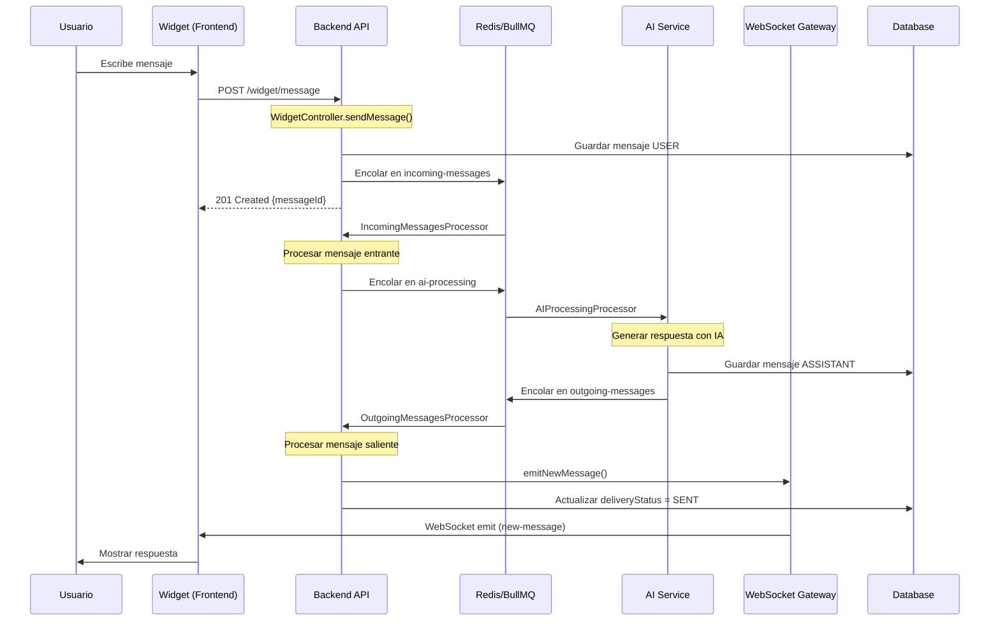

# Flujo de Mensajes - Widget

Este documento describe el flujo completo de mensajes desde que un usuario envía un mensaje a través del Widget hasta que recibe la respuesta del chatbot.

## Diagrama de Secuencia



## Pasos Detallados del Flujo

### 1. Usuario Envía Mensaje

**Componente:** Widget (Frontend)

El usuario escribe un mensaje en la interfaz del widget y presiona enviar.

**Acción:**
```javascript
// Widget envía POST request
fetch('http://localhost:3000/widget/message', {
  method: 'POST',
  headers: { 'Content-Type': 'application/json' },
  body: JSON.stringify({
    botId: 'chatbot-uuid',
    externalUserId: 'user-123',
    message: 'Hola, necesito ayuda'
  })
});
```

**Log Esperado:**
```json
{
  "timestamp": "2025-11-21T10:30:00.000Z",
  "level": "info",
  "message": "Incoming request to /widget/message",
  "context": "WidgetController",
  "data": {
    "botId": "chatbot-uuid",
    "externalUserId": "user-123",
    "messageLength": 21
  }
}
```

---

### 2. Backend Recibe y Valida Mensaje

**Componente:** `WidgetController` → `WidgetService`

**Archivo:** `backend/src/modules/widget/widget.controller.ts`

El backend recibe el mensaje, valida los datos y busca o crea la conversación.

**Código:**
```typescript
@Post('message')
async sendMessage(@Body() dto: SendWidgetMessageDto) {
  return this.widgetService.sendMessage(dto);
}
```

**Log Esperado:**
```json
{
  "timestamp": "2025-11-21T10:30:00.100Z",
  "level": "info",
  "message": "Widget message received",
  "context": "WidgetService",
  "data": {
    "messageId": "msg-uuid",
    "conversationId": "conv-uuid",
    "channel": "WIDGET",
    "botId": "chatbot-uuid"
  }
}
```

---

### 3. Guardar Mensaje USER en Base de Datos

**Componente:** `MessagesService`

**Archivo:** `backend/src/modules/messages/messages.service.ts`

Se crea el mensaje USER en la base de datos con el contenido del usuario.

**Código:**
```typescript
const message = await this.prisma.message.create({
  data: {
    conversationId,
    content,
    role: 'USER',
    channel: 'WIDGET',
    deliveryStatus: 'PENDING'
  }
});
```

**Log Esperado:**
```json
{
  "timestamp": "2025-11-21T10:30:00.200Z",
  "level": "info",
  "message": "Message saved to database",
  "context": "MessagesService",
  "data": {
    "messageId": "msg-uuid",
    "conversationId": "conv-uuid",
    "role": "USER",
    "channel": "WIDGET"
  }
}
```

---

### 4. Encolar Mensaje en incoming-messages Queue

**Componente:** `QueueService`

**Archivo:** `backend/src/modules/queues/queue.service.ts`

El mensaje se encola para procesamiento asíncrono.

**Código:**
```typescript
const job = await this.incomingMessagesQueue.add('process-incoming', {
  messageId: message.id,
  conversationId: message.conversationId,
  chatbotId: conversation.chatbotId
});
```

**Log Esperado:**
```json
{
  "timestamp": "2025-11-21T10:30:00.300Z",
  "level": "info",
  "message": "Message enqueued",
  "context": "QueueService",
  "data": {
    "messageId": "msg-uuid",
    "queueName": "incoming-messages",
    "jobId": "job-123"
  }
}
```

---

### 5. Procesar Mensaje Entrante

**Componente:** `IncomingMessagesProcessor`

**Archivo:** `backend/src/modules/queues/processors/incoming-messages.processor.ts`

El procesador consume el trabajo de la cola y prepara el mensaje para IA.

**Código:**
```typescript
@Process('process-incoming')
async handleIncomingMessage(job: Job) {
  const { messageId, conversationId, chatbotId } = job.data;
  
  // Obtener contexto de conversación
  const context = await this.getConversationContext(conversationId);
  
  // Encolar para AI processing
  await this.queueService.enqueueAIProcessing({
    messageId,
    conversationId,
    chatbotId,
    context
  });
}
```

**Log Esperado:**
```json
{
  "timestamp": "2025-11-21T10:30:00.500Z",
  "level": "info",
  "message": "Processing incoming message",
  "context": "IncomingMessagesProcessor",
  "data": {
    "jobId": "job-123",
    "messageId": "msg-uuid",
    "conversationId": "conv-uuid"
  }
}
```

---

### 6. Generar Respuesta con IA

**Componente:** `AIProcessingProcessor` → `AIService`

**Archivo:** `backend/src/modules/queues/processors/ai-processing.processor.ts`

Se genera la respuesta usando el proveedor de IA configurado (OpenAI, etc.).

**Código:**
```typescript
@Process('process-ai')
async handleAIProcessing(job: Job) {
  const { messageId, chatbotId, context } = job.data;
  
  // Generar respuesta
  const response = await this.aiService.generateResponse({
    chatbotId,
    messages: context,
    userMessage: message.content
  });
  
  // Guardar mensaje ASSISTANT
  const assistantMessage = await this.messagesService.create({
    conversationId,
    content: response.content,
    role: 'ASSISTANT',
    channel: 'WIDGET'
  });
}
```

**Log Esperado:**
```json
{
  "timestamp": "2025-11-21T10:30:01.000Z",
  "level": "info",
  "message": "AI response generated",
  "context": "AIProcessingProcessor",
  "data": {
    "messageId": "msg-uuid",
    "assistantMessageId": "msg-assistant-uuid",
    "provider": "openai",
    "model": "gpt-4",
    "tokensUsed": 150,
    "responseTime": 1200
  }
}
```

---

### 7. Encolar Mensaje Saliente

**Componente:** `AIProcessingProcessor`

Después de generar la respuesta, se encola para envío al usuario.

**Código:**
```typescript
await this.queueService.enqueueOutgoingMessage({
  messageId: assistantMessage.id,
  conversationId,
  channel: 'WIDGET'
});
```

**Log Esperado:**
```json
{
  "timestamp": "2025-11-21T10:30:01.100Z",
  "level": "info",
  "message": "Outgoing message enqueued",
  "context": "AIProcessingProcessor",
  "data": {
    "messageId": "msg-assistant-uuid",
    "queueName": "outgoing-messages",
    "channel": "WIDGET"
  }
}
```

---

### 8. Procesar Mensaje Saliente (Widget)

**Componente:** `OutgoingMessagesProcessor`

**Archivo:** `backend/src/modules/queues/processors/outgoing-messages.processor.ts`

El procesador determina el canal y envía el mensaje apropiadamente.

**Código:**
```typescript
@Process('send-outgoing')
async handleOutgoingMessage(job: Job) {
  const { messageId } = job.data;
  const message = await this.messagesService.findOne(messageId);
  
  if (message.channel === 'WIDGET') {
    await this.handleWidgetMessage(message);
  }
}

private async handleWidgetMessage(message: Message) {
  // Emitir via WebSocket
  await this.messagesGateway.emitNewMessage(
    message.conversationId,
    message
  );
  
  // Actualizar estado
  await this.messagesService.updateDeliveryStatus(
    message.id,
    'SENT'
  );
}
```

**Log Esperado:**
```json
{
  "timestamp": "2025-11-21T10:30:01.300Z",
  "level": "info",
  "message": "Processing outgoing message for Widget",
  "context": "OutgoingMessagesProcessor",
  "data": {
    "messageId": "msg-assistant-uuid",
    "conversationId": "conv-uuid",
    "channel": "WIDGET"
  }
}
```

---

### 9. Emitir Mensaje via WebSocket

**Componente:** `MessagesGateway`

**Archivo:** `backend/src/modules/messages/messages.gateway.ts`

El mensaje se emite a todos los clientes conectados al room de la conversación.

**Código:**
```typescript
async emitNewMessage(conversationId: string, message: Message) {
  const room = `conversation:${conversationId}`;
  const clients = this.server.in(room).allSockets();
  
  this.server.to(room).emit('new-message', {
    id: message.id,
    content: message.content,
    role: message.role,
    createdAt: message.createdAt
  });
}
```

**Log Esperado:**
```json
{
  "timestamp": "2025-11-21T10:30:01.400Z",
  "level": "info",
  "message": "Message emitted via WebSocket",
  "context": "MessagesGateway",
  "data": {
    "messageId": "msg-assistant-uuid",
    "conversationId": "conv-uuid",
    "room": "conversation:conv-uuid",
    "connectedClients": 1
  }
}
```

---

### 10. Widget Recibe y Muestra Respuesta

**Componente:** Widget (Frontend)

El widget escucha el evento WebSocket y actualiza la UI.

**Código:**
```javascript
socket.on('new-message', (message) => {
  if (message.role === 'ASSISTANT') {
    displayMessage(message);
  }
});
```

**Log Esperado (Frontend Console):**
```
[Widget] New message received: msg-assistant-uuid
[Widget] Displaying assistant response
```

---

## Resumen del Flujo

| Paso | Componente | Tiempo Aprox. | Estado |
|------|-----------|---------------|--------|
| 1 | Widget → API | 0ms | Inicio |
| 2 | WidgetController | 50ms | Validación |
| 3 | MessagesService | 100ms | DB Write |
| 4 | QueueService | 50ms | Enqueue |
| 5 | IncomingProcessor | 200ms | Procesamiento |
| 6 | AIProcessor | 1000ms | IA |
| 7 | QueueService | 50ms | Enqueue |
| 8 | OutgoingProcessor | 100ms | Routing |
| 9 | WebSocket | 50ms | Emisión |
| 10 | Widget | 0ms | Display |
| **TOTAL** | | **~1.6s** | Completo |

## Verificación del Flujo

Para verificar que el flujo funciona correctamente:

1. **Verificar logs en tiempo real:**
```bash
cd backend
npm run start:dev | grep -E "Widget|Message|Queue"
```

2. **Usar endpoint de health check:**
```bash
curl http://localhost:3000/health/queues
```

3. **Monitorear WebSocket:**
```bash
# En browser console
socket.on('connect', () => console.log('Connected'));
socket.on('new-message', (msg) => console.log('Received:', msg));
```

## Problemas Comunes

### Mensaje no llega al Widget

**Síntoma:** El usuario envía mensaje pero no recibe respuesta.

**Verificar:**
1. ¿El WebSocket está conectado? → Check browser console
2. ¿El cliente está suscrito al room correcto? → Check logs de MessagesGateway
3. ¿El mensaje se emitió? → Check logs "Message emitted via WebSocket"

**Solución:**
```javascript
// Verificar conexión
if (!socket.connected) {
  socket.connect();
}

// Verificar suscripción
socket.emit('subscribe-conversation', { conversationId });
```

### Respuesta tarda mucho

**Síntoma:** La respuesta tarda más de 5 segundos.

**Verificar:**
1. ¿Redis está respondiendo? → `redis-cli ping`
2. ¿Las colas tienen trabajos stuck? → `GET /health/queues`
3. ¿El proveedor de IA está lento? → Check logs de AIService

**Solución:**
- Aumentar timeout de AI provider
- Verificar circuit breaker no esté activado
- Revisar rate limits de OpenAI

## Referencias

- [Documentación de BullMQ](https://docs.bullmq.io/)
- [Socket.IO Documentation](https://socket.io/docs/v4/)
- [OpenAI API Reference](https://platform.openai.com/docs/api-reference)
