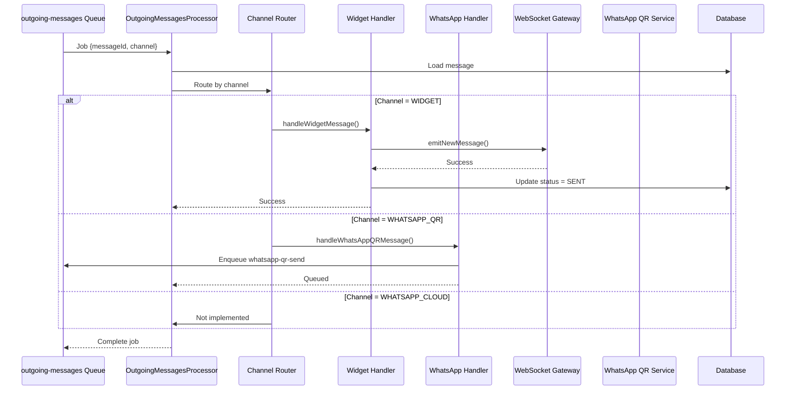

# Envío de Mensajes Salientes

Este documento describe cómo el sistema enruta y envía mensajes salientes a los diferentes canales (Widget, WhatsApp QR), incluyendo el manejo de errores y la lógica de retry.

## Arquitectura de Envío

```
┌─────────────────────────────────────────────────────────┐
│              Outgoing Messages Layer                     │
│                                                          │
│  ┌──────────────┐    ┌──────────────┐    ┌──────────┐ │
│  │   Outgoing   │───▶│   Channel    │───▶│  Widget  │ │
│  │   Messages   │    │   Router     │    │ Handler  │ │
│  │  Processor   │    │              │    │          │ │
│  └──────────────┘    └──────────────┘    └──────────┘ │
│         │                    │                          │
│         │                    │                          │
│         │                    ▼                          │
│         │            ┌──────────────┐                  │
│         │            │  WhatsApp QR │                  │
│         │            │   Handler    │                  │
│         │            └──────────────┘                  │
│         │                    │                          │
│         ▼                    ▼                          │
│  ┌──────────────┐    ┌──────────────┐                 │
│  │    Retry     │    │   Delivery   │                 │
│  │    Logic     │    │    Status    │                 │
│  └──────────────┘    └──────────────┘                 │
└─────────────────────────────────────────────────────────┘
```

## Flujo de Procesamiento

### Diagrama de Secuencia



## Componentes

### 1. Outgoing Messages Processor

**Archivo:** `backend/src/modules/queues/processors/outgoing-messages.processor.ts`

Procesador principal que coordina el envío de mensajes salientes.

**Responsabilidades:**
- Consumir trabajos de la cola `outgoing-messages`
- Cargar mensaje de la base de datos
- Determinar canal de envío
- Delegar a handler específico del canal
- Manejar errores y retry

**Código:**
```typescript
@Processor('outgoing-messages')
export class OutgoingMessagesProcessor {
  constructor(
    private messagesService: MessagesService,
    private messagesGateway: MessagesGateway,
    private queueService: QueueService,
    private logger: Logger
  ) {}

  @Process('send-outgoing')
  async handleOutgoingMessage(job: Job) {
    const { messageId, conversationId, channel } = job.data;
    
    this.logger.log(`Processing outgoing message ${messageId} for channel ${channel}`);
    
    try {
      // 1. Cargar mensaje
      const message = await this.messagesService.findOne(messageId);
      
      if (!message) {
        throw new Error(`Message ${messageId} not found`);
      }
      
      // 2. Routing por canal
      switch (message.channel) {
        case 'WIDGET':
          await this.handleWidgetMessage(message);
          break;
          
        case 'WHATSAPP_QR':
          await this.handleWhatsAppQRMessage(message);
          break;
          
        case 'WHATSAPP_CLOUD':
          await this.handleWhatsAppCloudMessage(message);
          break;
          
        default:
          throw new Error(`Unsupported channel: ${message.channel}`);
      }
      
      this.logger.log(`Outgoing message ${messageId} processed successfully`);
      
    } catch (error) {
      this.logger.error(
        `Failed to process outgoing message ${messageId}: ${error.message}`,
        error.stack
      );
      throw error; // BullMQ will retry
    }
  }
  
  private async handleWidgetMessage(message: Message): Promise<void> {
    this.logger.log(`Sending message ${message.id} via WebSocket`);
    
    // Emitir via WebSocket
    await this.messagesGateway.emitNewMessage(
      message.conversationId,
      message
    );
    
    // Actualizar estado
    await this.messagesService.updateDeliveryStatus(
      message.id,
      'SENT'
    );
    
    this.logger.log(`Message ${message.id} sent via WebSocket`);
  }
  
  private async handleWhatsAppQRMessage(message: Message): Promise<void> {
    this.logger.log(`Queueing message ${message.id} for WhatsApp QR`);
    
    // Encolar en cola específica de WhatsApp QR
    await this.queueService.enqueueWhatsAppQRSend({
      messageId: message.id,
      conversationId: message.conversationId
    });
    
    this.logger.log(`Message ${message.id} queued for WhatsApp QR`);
  }
  
  private async handleWhatsAppCloudMessage(message: Message): Promise<void> {
    throw new Error('WhatsApp Cloud not implemented yet');
  }
}
```

---

### 2. Channel Router

El routing se hace mediante un simple switch statement basado en el campo `channel` del mensaje.

**Canales Soportados:**
- `WIDGET` - Chat embebible en sitios web
- `WHATSAPP_QR` - WhatsApp via código QR
- `WHATSAPP_CLOUD` - WhatsApp Business API (futuro)

**Lógica de Routing:**
```typescript
switch (message.channel) {
  case 'WIDGET':
    // Envío directo via WebSocket
    await this.handleWidgetMessage(message);
    break;
    
  case 'WHATSAPP_QR':
    // Encolar en cola específica
    await this.handleWhatsAppQRMessage(message);
    break;
    
  case 'WHATSAPP_CLOUD':
    // No implementado
    throw new Error('Not implemented');
    break;
    
  default:
    throw new Error(`Unknown channel: ${message.channel}`);
}
```

---

### 3. Widget Handler

**Responsabilidad:** Enviar mensajes via WebSocket a clientes conectados.

**Flujo:**
1. Obtener room de la conversación
2. Emitir mensaje a todos los clientes en el room
3. Actualizar deliveryStatus a 'SENT'

**Código:**
```typescript
private async handleWidgetMessage(message: Message): Promise<void> {
  const room = `conversation:${message.conversationId}`;
  
  // Verificar si hay clientes conectados
  const clients = await this.messagesGateway.getClientsInRoom(room);
  
  this.logger.log(`Emitting message to room ${room} (${clients.length} clients)`);
  
  // Emitir mensaje
  await this.messagesGateway.emitNewMessage(
    message.conversationId,
    {
      id: message.id,
      content: message.content,
      role: message.role,
      createdAt: message.createdAt
    }
  );
  
  // Actualizar estado
  await this.messagesService.updateDeliveryStatus(
    message.id,
    'SENT'
  );
  
  this.logger.log(`Message ${message.id} sent to ${clients.length} clients`);
}
```

**Nota:** El mensaje se marca como 'SENT' incluso si no hay clientes conectados. Esto es intencional porque:
- El mensaje está disponible en la base de datos
- El cliente lo verá cuando se conecte
- No queremos reintentar indefinidamente

---

### 4. WhatsApp QR Handler

**Responsabilidad:** Encolar mensajes para envío al microservicio de WhatsApp QR.

**Flujo:**
1. Encolar en `whatsapp-qr-send` queue
2. El procesador específico se encarga del envío real

**Código:**
```typescript
private async handleWhatsAppQRMessage(message: Message): Promise<void> {
  // Encolar en cola específica
  await this.queueService.enqueueWhatsAppQRSend({
    messageId: message.id,
    conversationId: message.conversationId
  });
  
  // No actualizamos deliveryStatus aquí
  // Lo hará el WhatsAppQRSendProcessor después de enviar
}
```

**¿Por qué una cola separada?**
- Permite rate limiting específico para WhatsApp
- Facilita retry logic diferente
- Aísla fallos del microservicio

---

### 5. WhatsApp QR Send Processor

**Archivo:** `backend/src/modules/queues/processors/whatsapp-qr-send.processor.ts`

Procesador específico para enviar mensajes al microservicio de WhatsApp QR.

**Código:**
```typescript
@Processor('whatsapp-qr-send')
export class WhatsAppQRSendProcessor {
  constructor(
    private messagesService: MessagesService,
    private conversationsService: ConversationsService,
    private whatsappQRService: WhatsAppQRService,
    private logger: Logger
  ) {}

  @Process('send-whatsapp-qr')
  async handleWhatsAppQRSend(job: Job) {
    const { messageId, conversationId } = job.data;
    
    this.logger.log(`Sending WhatsApp QR message ${messageId}`);
    
    try {
      // 1. Cargar mensaje y conversación
      const message = await this.messagesService.findOne(messageId);
      const conversation = await this.conversationsService.findOne(conversationId);
      
      // 2. Enviar al microservicio
      const result = await this.whatsappQRService.sendMessageDirect(
        conversation.chatbotId,
        conversation.externalUserId,
        message.content
      );
      
      // 3. Actualizar estado según resultado
      const status = result.success ? 'SENT' : 'FAILED';
      await this.messagesService.updateDeliveryStatus(messageId, status);
      
      if (result.success) {
        this.logger.log(`WhatsApp QR message ${messageId} sent successfully`);
      } else {
        throw new Error(`Failed to send: ${result.error}`);
      }
      
    } catch (error) {
      this.logger.error(
        `Failed to send WhatsApp QR message ${messageId}: ${error.message}`,
        error.stack
      );
      
      // Actualizar estado a FAILED
      await this.messagesService.updateDeliveryStatus(messageId, 'FAILED');
      
      throw error; // BullMQ will retry
    }
  }
}
```

---

## Delivery Status

Los mensajes tienen un campo `deliveryStatus` que indica su estado de entrega.

### Estados Posibles

```typescript
enum DeliveryStatus {
  PENDING = 'PENDING',     // Creado, esperando envío
  SENT = 'SENT',           // Enviado exitosamente
  DELIVERED = 'DELIVERED', // Confirmado por el destinatario (futuro)
  READ = 'READ',           // Leído por el destinatario (futuro)
  FAILED = 'FAILED'        // Falló el envío
}
```

### Transiciones de Estado

```
PENDING → SENT → DELIVERED → READ
   ↓
FAILED
```

### Actualización de Estado

```typescript
async updateDeliveryStatus(
  messageId: string,
  status: DeliveryStatus
): Promise<void> {
  await this.prisma.message.update({
    where: { id: messageId },
    data: {
      deliveryStatus: status,
      deliveredAt: status === 'SENT' ? new Date() : undefined
    }
  });
  
  this.logger.log(`Message ${messageId} status updated to ${status}`);
}
```

---

## Manejo de Errores

### Tipos de Errores

#### 1. Message Not Found
```typescript
if (!message) {
  throw new Error(`Message ${messageId} not found`);
}
```
**Acción:** No retry, marcar job como fallido

#### 2. Unsupported Channel
```typescript
default:
  throw new Error(`Unsupported channel: ${message.channel}`);
```
**Acción:** No retry, marcar job como fallido

#### 3. WebSocket Emission Failed
```typescript
try {
  await this.messagesGateway.emitNewMessage(conversationId, message);
} catch (error) {
  this.logger.error(`WebSocket emission failed: ${error.message}`);
  // Marcar como SENT de todas formas
}
```
**Acción:** Log error pero marcar como SENT

#### 4. WhatsApp QR Service Unavailable
```typescript
try {
  await this.whatsappQRService.sendMessageDirect(...);
} catch (error) {
  if (error.code === 'ECONNREFUSED') {
    throw new Error('WhatsApp QR Service unavailable');
  }
}
```
**Acción:** Retry con backoff exponencial

#### 5. WhatsApp Session Not Connected
```typescript
if (result.error === 'Session not connected') {
  throw new Error('WhatsApp session not connected');
}
```
**Acción:** Retry limitado, luego marcar como FAILED

---

## Retry Logic

### Configuración de Retry

```typescript
// En queue configuration
{
  attempts: 3,
  backoff: {
    type: 'exponential',
    delay: 2000 // 2s, 4s, 8s
  }
}
```

### Estrategia por Canal

#### Widget (WebSocket)
- **Attempts:** 1 (no retry)
- **Razón:** Si el cliente no está conectado, no tiene sentido reintentar
- **Fallback:** Mensaje queda en DB, cliente lo verá al conectarse

#### WhatsApp QR
- **Attempts:** 3
- **Backoff:** Exponencial (2s, 4s, 8s)
- **Razón:** Fallos temporales del microservicio o red
- **Fallback:** Marcar como FAILED después de 3 intentos

#### WhatsApp Cloud (futuro)
- **Attempts:** 5
- **Backoff:** Exponencial (5s, 10s, 20s, 40s, 80s)
- **Razón:** API externa puede tener rate limits

### Cuándo NO Hacer Retry

❌ **No retry en estos casos:**
- Mensaje no existe en DB
- Canal no soportado
- Sesión de WhatsApp no existe
- Error de validación de datos

✅ **Sí retry en estos casos:**
- Timeout de red
- Microservicio temporalmente no disponible
- Rate limit temporal
- Error 5xx del servidor

### Implementación de Retry Condicional

```typescript
@Process('send-outgoing')
async handleOutgoingMessage(job: Job) {
  try {
    // ... processing logic
  } catch (error) {
    // Determinar si es retryable
    if (this.isRetryableError(error)) {
      throw error; // BullMQ will retry
    } else {
      // Marcar como fallido permanentemente
      await this.messagesService.updateDeliveryStatus(
        job.data.messageId,
        'FAILED'
      );
      // No throw, job completes
    }
  }
}

private isRetryableError(error: Error): boolean {
  const retryableErrors = [
    'ETIMEDOUT',
    'ECONNREFUSED',
    'ENOTFOUND',
    'Service unavailable',
    'Rate limit'
  ];
  
  return retryableErrors.some(msg => 
    error.message.includes(msg) || error.code === msg
  );
}
```

---

## Logs Esperados

### Procesamiento Exitoso (Widget)

```json
{
  "timestamp": "2025-11-21T10:30:01.300Z",
  "level": "info",
  "message": "Processing outgoing message",
  "context": "OutgoingMessagesProcessor",
  "data": {
    "messageId": "msg-uuid",
    "conversationId": "conv-uuid",
    "channel": "WIDGET"
  }
}

{
  "timestamp": "2025-11-21T10:30:01.350Z",
  "level": "info",
  "message": "Sending message via WebSocket",
  "context": "OutgoingMessagesProcessor",
  "data": {
    "messageId": "msg-uuid",
    "room": "conversation:conv-uuid",
    "connectedClients": 1
  }
}

{
  "timestamp": "2025-11-21T10:30:01.400Z",
  "level": "info",
  "message": "Message sent via WebSocket",
  "context": "OutgoingMessagesProcessor",
  "data": {
    "messageId": "msg-uuid",
    "deliveryStatus": "SENT"
  }
}
```

### Procesamiento Exitoso (WhatsApp QR)

```json
{
  "timestamp": "2025-11-21T10:30:01.700Z",
  "level": "info",
  "message": "Processing outgoing message",
  "context": "OutgoingMessagesProcessor",
  "data": {
    "messageId": "msg-uuid",
    "conversationId": "conv-uuid",
    "channel": "WHATSAPP_QR"
  }
}

{
  "timestamp": "2025-11-21T10:30:01.750Z",
  "level": "info",
  "message": "Queueing message for WhatsApp QR",
  "context": "OutgoingMessagesProcessor",
  "data": {
    "messageId": "msg-uuid",
    "queueName": "whatsapp-qr-send"
  }
}

{
  "timestamp": "2025-11-21T10:30:01.800Z",
  "level": "info",
  "message": "Sending WhatsApp QR message",
  "context": "WhatsAppQRSendProcessor",
  "data": {
    "messageId": "msg-uuid",
    "sessionId": "session-uuid"
  }
}

{
  "timestamp": "2025-11-21T10:30:02.000Z",
  "level": "info",
  "message": "WhatsApp QR message sent successfully",
  "context": "WhatsAppQRSendProcessor",
  "data": {
    "messageId": "msg-uuid",
    "deliveryStatus": "SENT"
  }
}
```

### Error con Retry

```json
{
  "timestamp": "2025-11-21T10:30:01.800Z",
  "level": "error",
  "message": "Failed to send WhatsApp QR message",
  "context": "WhatsAppQRSendProcessor",
  "error": "ECONNREFUSED",
  "data": {
    "messageId": "msg-uuid",
    "attempt": 1,
    "maxAttempts": 3
  }
}

{
  "timestamp": "2025-11-21T10:30:03.800Z",
  "level": "info",
  "message": "Retrying WhatsApp QR message",
  "context": "WhatsAppQRSendProcessor",
  "data": {
    "messageId": "msg-uuid",
    "attempt": 2,
    "delay": 4000
  }
}
```

### Error Permanente

```json
{
  "timestamp": "2025-11-21T10:30:09.800Z",
  "level": "error",
  "message": "Failed to send WhatsApp QR message after 3 attempts",
  "context": "WhatsAppQRSendProcessor",
  "error": "ECONNREFUSED",
  "data": {
    "messageId": "msg-uuid",
    "attempts": 3,
    "deliveryStatus": "FAILED"
  }
}
```

---

## Monitoreo

### Métricas Clave

1. **Tasa de Envío Exitoso**
   ```
   (Mensajes SENT / Total Mensajes) * 100
   ```
   Meta: > 99%

2. **Tiempo de Procesamiento**
   ```
   Tiempo desde enqueue hasta SENT
   ```
   Meta: < 500ms (Widget), < 2s (WhatsApp QR)

3. **Tasa de Retry**
   ```
   (Mensajes con retry / Total Mensajes) * 100
   ```
   Meta: < 5%

4. **Mensajes Fallidos**
   ```
   Mensajes con status FAILED
   ```
   Meta: < 1%

### Health Check

```bash
GET /health/queues
```

**Respuesta:**
```json
{
  "queues": [
    {
      "name": "outgoing-messages",
      "waiting": 0,
      "active": 2,
      "completed": 1523,
      "failed": 5,
      "paused": false
    },
    {
      "name": "whatsapp-qr-send",
      "waiting": 1,
      "active": 0,
      "completed": 856,
      "failed": 12,
      "paused": false
    }
  ]
}
```

### Alertas Recomendadas

1. **Cola con muchos trabajos esperando**
   - Condición: `waiting > 100`
   - Acción: Verificar procesadores están corriendo

2. **Alta tasa de fallos**
   - Condición: `failed / completed > 0.05`
   - Acción: Revisar logs de errores

3. **Trabajos stuck en active**
   - Condición: `active > 0` por más de 5 minutos
   - Acción: Reiniciar procesadores

---

## Optimizaciones

### 1. Batch Processing

Para enviar múltiples mensajes a la vez:

```typescript
@Process('send-outgoing-batch')
async handleBatch(job: Job) {
  const { messageIds } = job.data;
  
  const results = await Promise.allSettled(
    messageIds.map(id => this.sendMessage(id))
  );
  
  // Log resultados
  const succeeded = results.filter(r => r.status === 'fulfilled').length;
  const failed = results.filter(r => r.status === 'rejected').length;
  
  this.logger.log(`Batch: ${succeeded} succeeded, ${failed} failed`);
}
```

### 2. Priority Queue

Mensajes urgentes primero:

```typescript
await this.queueService.enqueueOutgoingMessage(
  { messageId, conversationId, channel },
  { priority: 1 } // 1 = alta, 10 = baja
);
```

### 3. Rate Limiting

Limitar envíos por canal:

```typescript
// En queue configuration
{
  limiter: {
    max: 10,      // máximo 10 mensajes
    duration: 1000 // por segundo
  }
}
```

---

## Testing

### Unit Tests

```typescript
describe('OutgoingMessagesProcessor', () => {
  it('should send Widget message via WebSocket', async () => {
    const message = createTestMessage({ channel: 'WIDGET' });
    
    await processor.handleOutgoingMessage({
      data: { messageId: message.id }
    });
    
    expect(messagesGateway.emitNewMessage).toHaveBeenCalled();
    expect(message.deliveryStatus).toBe('SENT');
  });
  
  it('should queue WhatsApp QR message', async () => {
    const message = createTestMessage({ channel: 'WHATSAPP_QR' });
    
    await processor.handleOutgoingMessage({
      data: { messageId: message.id }
    });
    
    expect(queueService.enqueueWhatsAppQRSend).toHaveBeenCalled();
  });
  
  it('should retry on retryable error', async () => {
    const error = new Error('ECONNREFUSED');
    whatsappQRService.sendMessageDirect.mockRejectedValue(error);
    
    await expect(
      processor.handleOutgoingMessage({ data: { messageId: 'test' } })
    ).rejects.toThrow();
    
    // BullMQ will retry
  });
});
```

### Integration Tests

```typescript
describe('Outgoing Messages E2E', () => {
  it('should send message through complete flow', async () => {
    // Create message
    const message = await messagesService.create({
      conversationId: 'test-conv',
      content: 'Test response',
      role: 'ASSISTANT',
      channel: 'WIDGET'
    });
    
    // Enqueue
    await queueService.enqueueOutgoingMessage({
      messageId: message.id,
      conversationId: 'test-conv',
      channel: 'WIDGET'
    });
    
    // Wait for processing
    await waitForJobCompletion('outgoing-messages');
    
    // Verify sent
    const updated = await messagesService.findOne(message.id);
    expect(updated.deliveryStatus).toBe('SENT');
  });
});
```

---

## Troubleshooting

### Problema: Mensajes no se envían

**Verificar:**
1. ¿La cola está procesando trabajos?
   ```bash
   curl http://localhost:3000/health/queues
   ```

2. ¿Hay trabajos en la cola?
   ```bash
   redis-cli
   > LLEN bull:outgoing-messages:waiting
   ```

3. ¿El procesador está registrado?
   ```bash
   # Buscar en logs
   grep "OutgoingMessagesProcessor" logs/combined.log
   ```

**Solución:**
- Reiniciar backend
- Verificar Redis está corriendo
- Verificar no hay errores en logs

---

### Problema: Mensajes se marcan como FAILED

**Verificar:**
1. ¿Qué error está ocurriendo?
   ```bash
   grep "FAILED" logs/error.log | tail -20
   ```

2. ¿Es un error retryable?
   - Sí → Aumentar attempts en configuración
   - No → Corregir causa raíz

**Solución:**
- Para WhatsApp QR: Verificar microservicio está corriendo
- Para Widget: Verificar WebSocket está configurado
- Revisar logs detallados del error

---

## Referencias

- [BullMQ Retry Strategies](https://docs.bullmq.io/guide/retrying-failing-jobs)
- [WebSocket.IO Documentation](https://socket.io/docs/v4/)
- [Error Handling Best Practices](https://nodejs.org/en/docs/guides/error-handling/)
